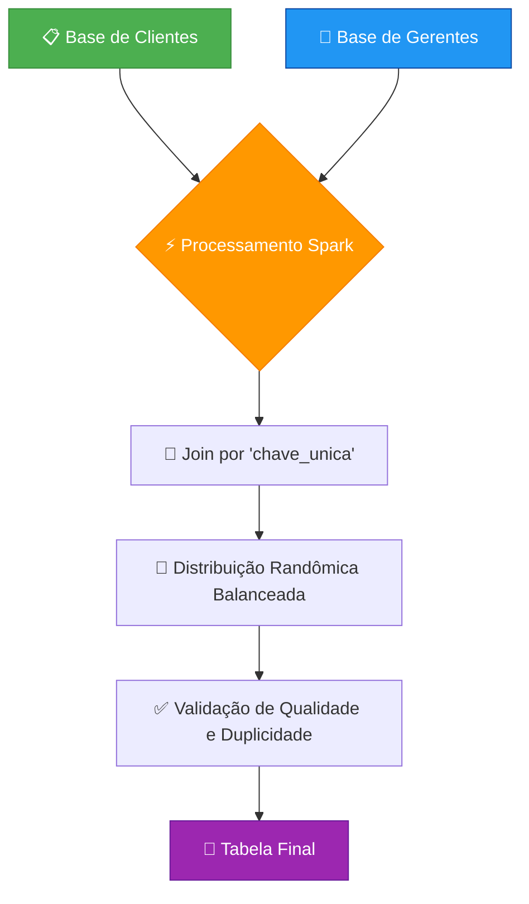

# 🏦 Sistema de Distribuição Inteligente de Carteira de Clientes

<div align="center">


</div>

---

## 📌 Visão Geral

Esta é uma **solução robusta em PySpark** desenvolvida para a **distribuição automatizada e balanceada** de clientes para gerentes de carteira em uma instituição financeira. O sistema foi projetado para garantir uma alocação eficiente, justa e rastreável, utilizando as melhores práticas de engenharia de dados.

### 🎯 **Principais Características**

<div align="center">

| Característica | Descrição | Status |
|----------------|-----------|--------|
| ⚡ **Alocação Inteligente por Chave Única** | Garante que clientes e gerentes sejam agrupados por uma chave de negócio comum (`chave_unica`) | ✅ |
| ⚖️ **Balanceamento Randômico** | Assegura uma distribuição equitativa de clientes entre os gerentes qualificados, evitando sobrecarga | ✅ |  
| 🔍 **Validação Rigorosa de Dados** | Implementa checagens para prevenir a duplicação de clientes, garantindo que cada cliente seja atribuído a um único gerente | ✅ |
| 📊 **Logging Detalhado** | Oferece rastreabilidade completa de todas as etapas do processo, desde a carga dos dados até a gravação final | ✅ |

</div>

---

## 📊 Fluxo do Sistema

O pipeline de dados segue um fluxo claro e objetivo, executado em um ambiente Spark.

<div align="center">



</div>

---

## 💡 Como Funciona?

O processo é orquestrado por meio de **funções modulares em PySpark**, garantindo clareza e manutenção.

### 🔄 **1. Carga e Preparação dos Dados**

Os dados de clientes e gerentes são carregados a partir de tabelas Spark. Registros com a chave de junção nula são descartados para garantir a qualidade da combinação.

```python
# Carrega os dados de clientes e gerentes
clientes_df = spark.table("path.base_clientes")
gerentes_df = spark.table("path.base_gerentes")

# Filtra registros inválidos
clientes_df = clientes_df.filter(F.col("chave_unica").isNotNull())
gerentes_df = gerentes_df.filter(F.col("chave_unica").isNotNull())
```

### ⚡ **2. Algoritmo de Distribuição**

A distribuição é realizada combinando as tabelas de clientes e gerentes pela `chave_unica`. Para garantir que cada cliente seja atribuído a apenas um gerente de forma balanceada, utilizamos uma função de janela (`Window`) particionada pelo número do cliente (`nr_cli`) e ordenada de forma aleatória (`F.rand()`).

```python
# Define a janela para distribuição aleatória
window_dist = Window.partitionBy("nr_cli").orderBy(F.rand())

# Realiza o join e aplica a regra de distribuição
distribuicao = (clientes_df.join(gerentes_df, "chave_unica")
                .withColumn("row_number", F.row_number().over(window_dist))
                .filter(F.col("row_number") == 1)
                .drop("row_number"))
```

### 🔍 **3. Validação da Integridade**

Após a distribuição, uma etapa de validação crucial é executada para confirmar que não existem clientes atribuídos a mais de um gerente. O processo é interrompido caso qualquer duplicidade seja encontrada.

```python
# Agrupa por cliente e conta as atribuições
duplicados = df.groupBy("nr_cli").agg(F.count("*").alias("qtd")).filter(F.col("qtd") > 1)

# Verifica se foram encontradas duplicidades
if duplicados.count() > 0:
    raise Exception("Erro: Clientes atribuídos a mais de um gerente!")
```

---

## 🚀 Resultados e Performance

A solução foi desenvolvida para entregar **resultados consistentes e performáticos** em um ambiente distribuído.

<div align="center">

| **Métrica** | **Resultado Esperado** |
|-------------|------------------------|
| 📊 **Clientes Distribuídos** | 100% dos clientes válidos, sem duplicidades |
| ⚖️ **Balanceamento** | Distribuição justa e aleatória, controlada por `F.rand()` |
| 📈 **Rastreabilidade** | Logs detalhados para cada etapa do processo |
| ⚡ **Performance** | Otimizado para processamento em larga escala com `spark.sql.shuffle.partitions` configurado para 600 partições |

</div>

---

## 🛠️ Como Executar

O script é parametrizado por meio de uma classe de configuração e pode ser executado em um ambiente Spark.

### ⚙️ **Configuração do Ambiente**

<details>
<summary><b>🔧 Configuração Inicial</b></summary>

A classe `ConfigDistribuicao` permite ajustar parâmetros do processo.

```python
@dataclass
class ConfigDistribuicao:
    """Configurações do processo de distribuição"""
    limite_clientes: int = 1473
```

**Configurações adicionais recomendadas:**
```python
# Configuração do Spark para otimização
spark.conf.set("spark.sql.shuffle.partitions", "600")
spark.conf.set("spark.sql.adaptive.enabled", "true")
spark.conf.set("spark.sql.adaptive.coalescePartitions.enabled", "true")
```

</details>

### 🚀 **Execução do Pipeline**

<details>
<summary><b>🎯 Execução em Cluster</b></summary>

O ponto de entrada do script é a função `main()`, que orquestra todas as etapas. Para submeter em um cluster, utilize o `spark-submit`.

```bash
# Execução em cluster YARN
spark-submit --master yarn --deploy-mode cluster distribuidor-clientes.py

# Execução com configurações customizadas
spark-submit \
  --master yarn \
  --deploy-mode cluster \
  --num-executors 10 \
  --executor-cores 4 \
  --executor-memory 8g \
  --driver-memory 4g \
  distribuidor-clientes.py
```

**Execução local para desenvolvimento:**
```bash
# Modo local
spark-submit --master local[*] distribuidor-clientes.py
```

</details>

### 📊 **Monitoramento e Logs**

<details>
<summary><b>📈 Acompanhamento da Execução</b></summary>

O andamento da execução pode ser acompanhado pelos logs gerados em tempo real.

```
2023-10-27 10:00:00 - INFO - Carregando dados de clientes e gerentes...
2023-10-27 10:01:00 - INFO - Iniciando processo de distribuição...
2023-10-27 10:02:00 - INFO - Validação concluída: cada cliente foi atribuído a um único gerente.
2023-10-27 10:03:00 - INFO - === Processo concluído com sucesso ===
```

**Monitoramento via Spark UI:**
- Acesse `http://driver-node:4040` para acompanhar jobs em tempo real
- Visualize métricas de performance e utilização de recursos
- Monitore o progresso de cada stage do pipeline

</details>

---

## 🔧 Stack Tecnológica

<div align="center">

| **Tecnologia** | **Finalidade** | **Versão** |
|----------------|----------------|------------|
| 🐍 **Python** | Linguagem principal para a lógica do script | 3.8+ |
| ⚡ **PySpark** | Framework de processamento distribuído para manipulação dos dados em larga escala | 3.4+ |
| 🧱 **Databricks** | Ambiente de execução otimizado para workloads Spark (sugerido) | Latest |
| 📝 **Git / GitHub** | Controle de versão e gerenciamento do código-fonte | - |

</div>

---

<div align="center">

### 🔒 **Nota de Privacidade**

> Este projeto foi desenvolvido seguindo as **melhores práticas de privacidade de dados**. Qualquer informação sensível utilizada no desenvolvimento foi devidamente **anonimizada**.

---
